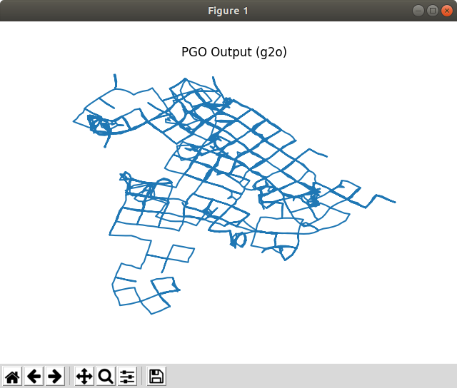
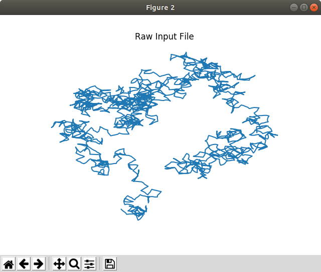

# Setup
For installation on a Linux machine, enter the following from the command line:

```
git clone https://github.com/jdriscoll7/distributed-slam
cd distributed-slam
sudo ./setup.sh
```

This will configure a Python virtual environment with all of the current dependencies, as well as download and install g2opy. The g2opy library provides Python bindings for g2o, a modern C++ PGO framework.

## Examples
See the "test" directory for examples of how to run PGO on the datasets contained in this repository. A simple example can be run with

```
cd test
../venv/bin/python3 test_slam.py
```
which will output some g2o logging information, along with a plot of the raw input data and the PGO result as shown below.


